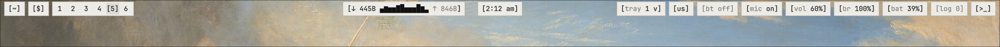
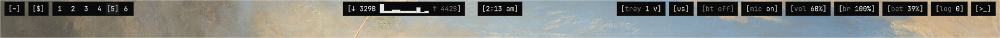
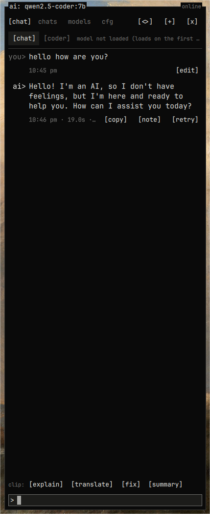

# kawt-shell

```
  ____________
 | >_         |    kawt // a Hyprland rice that looks like an old terminal
 |            |    ThinkPads, green phosphor, Mr. Robot, [brackets] everywhere
 |____________|
/ :::::●:::::: \
\______________/
```

A [Quickshell](https://quickshell.org) desktop shell for Hyprland, plus matching
configs, all in one monospace, square-cornered, text-first style.






## What's inside

**bar**: `[~] [$] [1] 2 3 · [wifi] [↓ ▁▃▅▇] [> ▂▅▃] [12:34] · [tray 3 v] [us] [vol 40%] [br 60%] [bat 72%] [log 2] [>_]`
(the wheel on the workspaces walks them; `[cast ● app]` shows while something captures the screen or the webcam, `[caf on]` while caffeine is on)

| | |
|---|---|
| `[~]` profile | your `~/.face` as ascii art, live cpu/mem graphs, today's tasks, a `top` with kill, todo (folders, importance, icons, notes inside, reminders), notes in folders with search, settings, power buttons |
| `[$]` dock | pinned apps |
| launcher | rofi-like, with modes: apps · `!` run · `>` in terminal · `=` calculator · `?` ask the ai · `:` clipboard history · `;` open windows |
| `[>_]` ai | chat with a local [ollama](https://ollama.com) model (nothing leaves the machine) or any OpenAI-compatible api; saved chats with times and speed, system prompt; a wide mode with a files column that can only attach text files from one folder you pick; personas, clipboard actions (explain / translate / fix / summary), markdown answers with framed code + copy, retry / edit / save to notes, compare two models, ctrl +/- text size, left or right side; context grows by itself for long messages and looping answers get stopped; installed models with sizes, pull / delete, what sits in ram and an unload button; limits for context, cpu threads, gpu and keep-alive so it doesn't eat the machine |
| `[log]` | notification daemon, `dmesg`-style history, do-not-disturb |
| style | wallpapers (arrow keys to pick) + themes: `mono` `amber` `phosphor` `thinkpad` and `wallpaper` (colors taken from the wallpaper: background, borders, terminal, in calm / strong / full strength), each dark (CRT) or light (paper) |
| theme export | switching themes recolors open terminals live and rewrites colors for kitty, Hyprland borders, foot, alacritty and shell scripts; terminal colors in three looks: `crt` (monochrome ink), `soft` (calm, in the theme's hues), `vivid` (bright) |
| coder | `[coder]` in the ai panel: an agent working in one project folder you pick. It lists, searches and reads files by itself; every change comes as a diff to `[apply]` or `[skip]`; `[undo]` puts back everything it changed. Nothing outside the folder can be touched. Wide mode shows its thinking as a small ascii network |
| lock | a terminal-style lock screen (`kawt lockTest` tries it safely: it unlocks itself after 30 s). It locks by itself before the machine sleeps (the lid, `systemctl suspend`, anything), on `loginctl lock-session`, and after 10 idle minutes; `[caf]` in the profile keeps the screen on. No hypridle / hyprlock needed |
| osd | volume / brightness pop up when they change; plugging the charger in or out shows the battery; low battery notifies at 20 / 10 / 5% |
| bluetooth | `[bt airpods 80%]`: on/off, scan, pair, connect, forget, headphone battery |
| mic | `[mic ● discord]` appears while an app records you (red), click to mute |
| recording | `[● rec 0:42]` in the bar; area or whole screen, optional mic audio |
| screenshots | area / window / screen, saved and copied to the clipboard |
| fastfetch | system info with the little thinkpad, `[####----]` meters and the current theme's colors (rewritten on every theme switch) |
| prompt | an oh-my-zsh theme: `┌[user@host]─[~/dir]─[branch*]` / `└$`, greeting with your motto; in the theme's own accent / dim / warn colors, switching with it at the next prompt |
| night light | warmer colors in the `[br]` panel or the profile's cfg (runs `hyprsunset`) |
| also | wifi, volume per app, brightness, battery + power profiles, mpris player, calendar, tray, keyboard layout |

## Layout

```
quickshell/kawt-shell/   the shell        -> ~/.config/quickshell/kawt-shell
  hypr/kawt.lua          Hyprland binds   (loaded from hyprland.lua)
  zsh/kawt.zsh-theme     prompt           (sourced from ~/.zshrc)
kitty/kitty.conf         terminal         -> ~/.config/kitty/kitty.conf
fastfetch/config.jsonc   fastfetch        -> ~/.local/state/kawt/theme/fastfetch.jsonc (kept in the theme's colors)
install.sh
```

## Install

```sh
git clone https://github.com/kfrttlw/kawt-shell ~/kawt
cd ~/kawt
./install.sh
```

```
-- what should go on this machine? --
 > everything       shell, terminal, prompt, fastfetch and the extras
   only the shell   the bar and panels + hyprland binds, nothing else
   let me pick      part by part
```

A menu asks which system this is (it guesses: Arch-based or not) and what to install
(arrows, space, enter). Then it shows the plan, and after a yes:

- installs what's missing with `pacman` (one `sudo pacman -Syu --needed ...`: the system is
  updated in the same go, Arch doesn't like half-updated systems; you can switch that off).
  Quickshell comes from the AUR if the repos don't have it: with `paru` or `yay` if you have
  one, otherwise built right there with `makepkg` (no helper needed). `pacman -Syu` never
  updates AUR packages: run `./install.sh` again now and then and it updates quickshell when
  the AUR has a newer one, and builds it again after a Qt update (`./doctor.sh` tells you
  when either is due). With paru / yay, their `-Syu` does the same
- symlinks the configs, so `git pull` updates everything in place. Configs that are already
  there are replaced but kept in `~/.local/state/kawt/backups/<date>/`
- gives your `hyprland.lua` one line that loads `hypr/kawt.lua` (wrapped in `pcall`, so a
  broken kawt can never take Hyprland down)
- asks before starting any service (bluetooth, ollama, power profiles). NetworkManager is never
  installed for you: next to iwd or systemd-networkd it can take the network over

It never runs as root (it asks for sudo itself, only for pacman), and running it again is safe.

Packages are installed on Arch and what's built on it (EndeavourOS, CachyOS, Manjaro...).
On another distro the installer still sets up everything of kawt's own (configs, binds,
prompt, fastfetch) and lists what to install yourself; quickshell itself: see
[quickshell.org](https://quickshell.org).

```sh
./install.sh --dry-run       # see what it would do
./install.sh --all --yes     # everything, no questions
./install.sh --shell-only    # just the shell
./install.sh --no-packages   # only link the configs, leave pacman alone
./install.sh --no-update     # install what's missing, no system update
./install.sh --uninstall     # remove the links and lines, put your old configs back
./install.sh --help
```

Keep the clone somewhere permanent (like `~/kawt`): the configs point into it.
Don't clone it into `~/.config/quickshell/kawt-shell` itself; the installer refuses that.

**Needs:** `quickshell` `hyprland` `kitty` `ttf-jetbrains-mono-nerd` `papirus-icon-theme` `libnotify` `grim` `slurp` `wl-clipboard` `cliphist` `wf-recorder` (brings `ffmpeg`), `brightnessctl` on laptops.
Services kawt talks to: `networkmanager` (wifi), `pipewire` (sound, mic), `upower` (battery), `bluez` (bluetooth), and systemd-logind with `glib2` (`gdbus`, for locking before sleep)
**Optional:** `oh-my-zsh` (prompt), `fortune-mod` (fortune motto), `ollama` (ai panel), `awww`/`swww` (wallpapers), `cava` (real sound bars next to the player), `power-profiles-daemon`, `hyprsunset` (night light)

The wallpaper theme measures each new wallpaper with `ffmpeg` (it comes with `wf-recorder`);
without it, only while `super + w` is open.

## Keys

| | |
|---|---|
| `super + space` | launcher |
| `super + r` | run a command |
| `super + shift + v` | clipboard history |
| `super + d` | pinned apps |
| `super + a` | ai panel |
| `super + w` / `super + shift + w` | wallpaper & themes / dark ↔ light |
| `super + n` / `super + shift + n` | notifications / do not disturb |
| `super + i` | profile, full screen (`[~]` opens the small one) |
| `super + l` | lock screen (it also locks by itself: before sleep, and after 10 idle minutes; any time or off in profile → cfg) |
| `super + /` | all keys (read from `hypr/kawt.lua`) |
| `super + escape` | power menu: shutdown / reboot / suspend / logout / lock, with a 5 s countdown |
| `print` / `super + shift + s` | screenshot of an area (`shift + print` screen, `alt + print` window) |
| `super + shift + r` / `super + alt + r` | record an area / the screen (same key again: stop) |

In the launcher: `↑↓` select, `ctrl+s` pin, `ctrl+tab` switch mode.
Everything is also reachable over IPC: `qs -c kawt-shell ipc call kawt toggle <panel>`,
`... kawt wallpaper next|prev|random|none|<path>` (for a timer or your own binds),
`... kawt suspend` (locks, then sleeps), `kawt caffeine`, `kawt idle <minutes>` (0 = never), `kawt night`,
`kawt volume up|down|mute`, `kawt mic mute`, `kawt brightness up|down|<percent>`.
The last three are for the media keys: there is a ready block in `hypr/kawt.lua` (and `kawt.conf`)
to uncomment, after removing your own XF86 binds. Through kawt, the osd shows at once.

## Environment

Nothing has to be set. The icon theme is picked in `shell.qml`
(`//@ pragma IconTheme Papirus-Dark`); to use another one, set `QS_ICON_THEME`
for the `qs` process. The ai panel talks to a local ollama by default, no API key involved;
if you switch it to an OpenAI-compatible api, the key is kept in
`~/.local/state/kawt/secrets.json`, readable only by you, never in the repo.

## Where things live

- `~/.local/state/kawt/settings.json`: theme, wallpaper, ai model...
- `~/.local/state/kawt/theme/`: generated color files, rewritten on every theme switch
- `quickshell/kawt-shell/config/Colors.qml`: the themes themselves; edit colors here

## Hacking

```sh
python3 tools/check.py   # catches the mistakes that stop the shell from loading
./doctor.sh              # where the "theme -> files -> apps" chain breaks on this machine
./colortest.sh           # which kind of terminal color something uses
tools/mem.sh -w          # how much ram and gpu memory kawt takes, live
```

## License

[GPL-3.0](LICENSE): use it, change it, share it; what you build on it and share stays open
too, under the same license.
